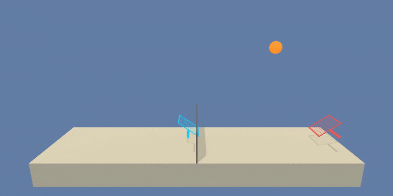

# Collaboration and Competition

This is the third and final project of [Deep Reinforcement Learning Udacity Nanodegree Program](https://eu.udacity.com/course/deep-reinforcement-learning-nanodegree--nd893).

## Introduction to the Environment

<table class="unchanged rich-diff-level-one">
  <thead><tr>
      <th align="left">Trained Agent</th>
  </tr></thead>
  <tbody>
    <tr>
      <td align="left"></td>
    </tr>
  </tbody>
</table>

In this environment, two agents control rackets to bounce a ball over a net. If an agent hits the ball over the net, it receives a reward of +0.1.  If an agent lets a ball hit the ground or hits the ball out of bounds, it receives a reward of -0.01.  Thus, the goal of each agent is to keep the ball in play.

The observation space consists of 8 variables corresponding to the position and velocity of the ball and racket. Each agent receives its own, local observation.  Two continuous actions are available, corresponding to movement toward (or away from) the net, and jumping.

The task is episodic, and in order to solve the environment, the agents must get an average score of +0.5 (over 100 consecutive episodes, after taking the maximum over both agents). Specifically,

- After each episode, we add up the rewards that each agent received (without discounting), to get a score for each agent. This yields 2 (potentially different) scores. We then take the maximum of these 2 scores.

- This yields a single **score** for each episode.

The environment is considered solved, when the average (over 100 episodes) of those **scores** is at least +0.5.

## Instructions

### 1. Setting up a Python environment

* Assuming that you have already installed either [Miniconda or Anaconda](https://www.anaconda.com/distribution/):\
please, follow the [instructions in the DRLND GitHub repository](https://github.com/udacity/deep-reinforcement-learning#dependencies) to set up your Python environment.

* You might need to install PyTorch separately [here](https://pytorch.org/get-started/locally/).

* Also, if you haven't yet, clone this repository and save it wherever you want!

### 2. Download the Unity Environment

You do __Not__ need to install Unity to run this code—the Udacity team has already built the environment for this project, and you can download it from one of the links below. You need only select the environment that matches your operating system (the download will start right as you click the link):

  - Linux \[44.5 MB]: [click here](https://s3-us-west-1.amazonaws.com/udacity-drlnd/P3/Tennis/Tennis_Linux.zip)
  - Mac OSX \[20.8 MB]: [click here](https://s3-us-west-1.amazonaws.com/udacity-drlnd/P3/Tennis/Tennis.app.zip)
  - Windows (32-bit) \[15.6 MB]: [click here](https://s3-us-west-1.amazonaws.com/udacity-drlnd/P3/Tennis/Tennis_Windows_x86.zip)
  - Windows (64-bit) \[18.0 MB]: [click here](https://s3-us-west-1.amazonaws.com/udacity-drlnd/P3/Tennis/Tennis_Windows_x86_64.zip)

Then, extract the content folder in any location you want (and remember the file path!).

### 3. Run the Notebook!

By now, you should be all set to run my notebook!

Follow the instructions in the notebook and have fun!

* The first section loads the environment file and demonstrates the environment with two agents performing random moves. (When loading the environment file, you need to manually set the file path to the environment (e.g. `"/path/to/where/you/saved/the/environment/Tennis_Windows_x86_64/Tennis.exe"`))
* The second section includes training codes for training smarter agents. (This will take some time.)
* The next section after training loads a pre-trained smart agents and shows their performances!
