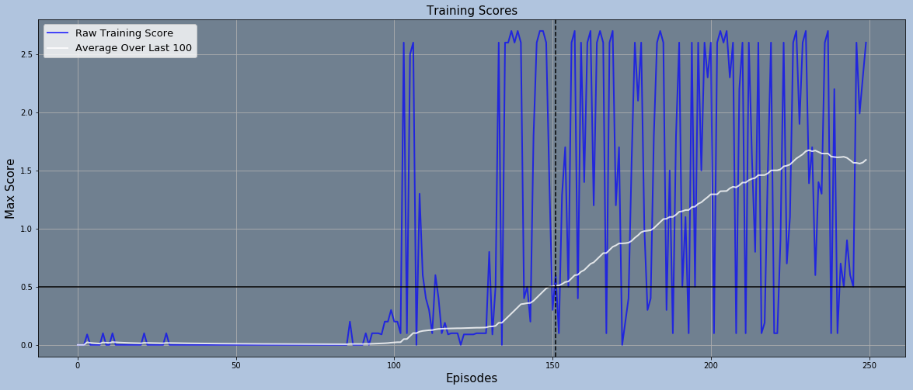
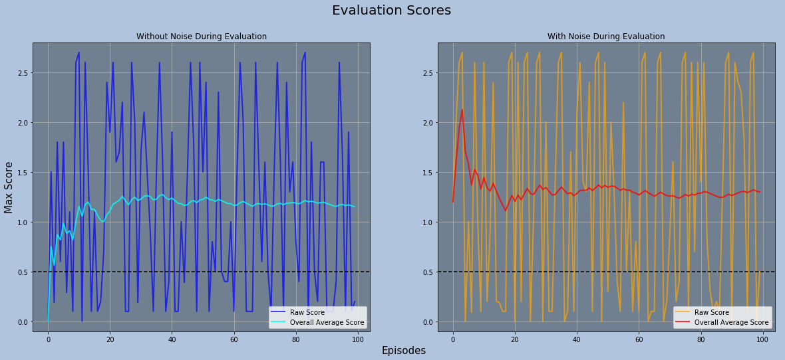

# Report of the Implementation & Performance

This report is written as a part of this project.

## Agent Algorithm

Although this environment involves two agents interacting with each other, the same algorithm used for single-agent environments such as DDPG or D4PG can be used for this particular task, thanks to the identical observation and action spaces. Not only does it make the solution simpler, this approach also has a better sample efficiency since the experiences from both agents can be treated independently. Therefore, with my implementation, both agents share the networks and replay memory buffer.

Most part of the implementation is from [my previous project](https://github.com/wytyang00/Udacity-DRL-Continuous-Control-Project). The only major differences are the architectures of the networks and noise.

The algorithms for the agent implemented in `ddqn_agent.py`, `model.py`, and `replay_buffer.py` are mainly based on [Deep Deterministic Policy Gradient](https://arxiv.org/abs/1509.02971) and [Distributional Deep Deterministic Policy Gradient](https://arxiv.org/abs/1804.08617).

Both implementation incorporate [Prioritized Experienced Replay](https://arxiv.org/abs/1511.05952), [Multi-step Bootstrap Targets](https://arxiv.org/abs/1602.01783), and [Noisy Networks](https://arxiv.org/abs/1706.10295). Each component comes with its own set of hyperparameters and some of them can be disabled through the hyperparameter setting.

The overall algorithm works like this:<br/>
1. The agents receive current observations.
2. The actor network takes in each observation and outputs an action for each input observation.
3. The agents take their actions and receives rewards, the next observations, and a pair of boolean values indicating whether the agents reached the terminal state.
4. A pair of experience tuples `(state, action, reward, next state, terminal reached)`—one from each agent—is passed to the replay buffer and stored independently in two separate temporal buffer.
5. If enough consecutive experience tuples are gathered in the temporal buffer, this buffer is copied and added to the main replay buffer with a maximum priority value.
6. Every `update_every` time steps, specified as a hyperparameter, randomly sample a batch of experiences with probabilities based on their priorities, take a learning step, and update the priorities according to the losses calculated during the learning step.
7. Repeat these steps until the training is finished.

During the learning step, the target actor and critic networks, separate from online networks, are used to calculate the expected target Q-value or the distribution of target Q-value. This target value or distribution is then used to update the online critic network to bring its estimates closer to the target value or distribution (using TD-error for scalar Q-values or Kullback-Leibler divergence for distributions). The losses calculated during this update is also used as updated priorities for each corresponding experience. After updating the online critic network, the online actor network is updated so that the actor network outputs actions with higher expected Q-value according to the updated online critic network.

`ReplayBuffer` contains a single main memory buffer and additional temporal buffers—one for each agent—for n-step bootstrap learning. Before the memories are fed into the main buffer, they are first stored in the corresponding temporal buffers, which are deque objects with `n_multisteps` length limits. Each temporal buffer is iterated and fed into the main memory when they are full, and they are emptied whenever the corresponding agent finishes the current episode.

The critic model contains both scalar and distributional network architectures, and which architecture to be used is determined via the hyperparameters `distributional`.

There are two kinds of noise available: parametric noise in the parameter space and action space noise sampled from OU process. The standard deviation of the OU process is controlled by a training parameter `eps`. Although it is possible to use both noises, it is recommended that only one type of noise is used.

## Hyperparameters

Almost all of the available hyperparameters are identical to the ones found in my [previous project](https://github.com/wytyang00/Udacity-DRL-Continuous-Control-Project). One exception is the hyperparameter `eps`; `eps` is now the standard deviation for Ornstein-Uhlenbeck process, not Gaussian noise. Although the [original D4PG paper](https://arxiv.org/abs/1804.08617) suggests that there's little difference in performance between the usage of Gaussian noise and OU noise, I found OU noise to perform much better than vanilla Gaussian noise.

Later, however, I set `eps` values to `0` to disable action space noise and used parametric noise in the parameter space in order to let the model optimize its exploration behavior, rather than using manual noise values.

Also, quite interestingly, using prioritized experience replay significantly hindered the training progress. Therefore, I set both `a` and `beta` to `0`, disabling prioritized sampling and importance-sampling weights.

Moreover, using n-step returns tended to hurt the performance of the agent severely as well. So, I also set `n_multisteps` to 1, which turns it into regular single-step TD learning.

I've done a quite extensive hyperparameter search for a few weeks and, after lots of experimentations and referring to a [similar & successful solution](https://github.com/shaziyev/drl-collaboration-and-competition), I decided to go with these values:

```python
hyperparams = {
    # Reproducibility
    'seed'                : 0,        # random seed for reproducible results

    # Agent basic parameters
    'batch_size'          : 1024,     # batch size for each learning step
    'buffer_size'         : int(1e6), # up to how many recent experiences to keep
    'start_since'         : 1024,     # how many experiences to collect before starting learning
    'gamma'               : 0.95,     # discount factor
    'update_every'        : 1,        # update step frequency
    'n_updates'           : 1,        # number of updates per update step
    'tau'                 : 0.2,      # soft-update parameter [0, 1]

    'actor_lr'            : 1e-3,     # learning rate for the actor network
    'critic_lr'           : 1e-3,     # learning rate for the critic network
    'clip'                : None,     # gradient clipping to prevent gradient spikes
    'weight_decay'        : 0,        # weight decay for the *critic* network

    'distributional'      : True,     # whether to use distributional learning

    # Prioritized Experience Replay Parameters
    'priority_eps'        : 1e-3,     # base priority in order to ensure nonzero priorities
    'a'                   : 0.,       # priority exponent parameter [0, 1]

    # n-step Bootstrap Target parameter
    'n_multisteps'        : 1,        # number of steps to bootstrap

    # Distributional Learning parameters
    'v_min'               : -0.1,     # minimum value for support
    'v_max'               : 0.1,      # maximum value for support
    'n_atoms'             : 51,       # number of atoms for distribution

    # Noisy Layer parameters
    'initial_sigma'       : 0.500,    # initial noisy parameter value
    'linear_type'         : 'noisy',  # either 'linear' or 'noisy'
    'factorized'          : True      # whether to use factorized gaussian noise or not(independent gaussian noise)
}

train_params = {
    'n_episodes'           : 250,     # number of total episodes to train
    'continue_after_solved': True,    # whether to keep training even after the environment is solved

    # Exploration using gaussian noise
    'eps_start'            : 0.,      # initial epsilon value
    'eps_min'              : 0.,      # minimum value for epsilon
    'eps_decay'            : 0.,      # epsilon decay rate

    # Importance-Sampling Weight parameter for Prioritized Experience Replay
    'beta_start'           : 0.,      # starting value
    'beta_end'             : 0.       # end value
}
```

I referred to [this repo](https://github.com/shaziyev/drl-collaboration-and-competition) for deciding the architectures of the actor and critic networks.
<br/>
The architecture of the Actor Network is as follows:
<table class="unchanged rich-diff-level-one">
  <tr>
    <td align="center"><code>States</code><br/>>>><br/>Input (, [<code>batch_size</code>, <code>state_size</code>])</td>
  </tr>
  <tr>
    <td align="center">BatchNorm ([<code>batch_size</code>, <code>state_size</code>], [<code>batch_size</code>, <code>state_size</code>])</td>
  </tr>
  <tr>
    <td align="center">Linear ([<code>batch_size</code>, <code>state_size</code>], [<code>batch_size</code>, 256])</td>
  </tr>
  <tr>
    <td align="center">BatchNorm ([<code>batch_size</code>, 256], [<code>batch_size</code>, 256])</td>
  </tr>
  <tr>
    <td align="center">ReLU()</td>
  </tr>
  <tr>
    <td align="center">Linear ([<code>batch_size</code>, 256], [<code>batch_size</code>, 128])</td>
  </tr>
  <tr>
    <td align="center">BatchNorm ([<code>batch_size</code>, 128], [<code>batch_size</code>, 128])</td>
  </tr>
  <tr>
    <td align="center">ReLU()</td>
  </tr>
  <tr>
    <td align="center">NoisyLinear ([<code>batch_size</code>, 128], [<code>batch_size</code>, 64])</td>
  </tr>
  <tr>
    <td align="center">BatchNorm ([<code>batch_size</code>, 64], [<code>batch_size</code>, 64])</td>
  </tr>
  <tr>
    <td align="center">ReLU()</td>
  </tr>
  <tr>
    <td align="center">NoisyLinear ([<code>batch_size</code>, 64], [<code>batch_size</code>, <code>action_size</code>])</td>
  </tr>
  <tr>
    <td align="center">Tanh()</td>
  </tr>
  <tr>
    <td align="center">Output (, [<code>batch_size</code>, <code>actions_size</code>])<br/>>>><br/><code>Actions</code></td>
  </tr>
</table>

<br/>
And the architecture of the Critic Network is as follows:
<table class="unchanged rich-diff-level-one">
  <tr>
    <td align="center" colspan="1"><code>States</code><br/>>>><br/>Input (, [<code>batch_size</code>, <code>state_size</code>])</td>
    <td align="center" colspan="1"></td>
  </tr>
  <tr>
    <td align="center" colspan="1">BatchNorm ([<code>batch_size</code>, <code>state_size</code>],<br/>[<code>batch_size</code>, <code>state_size</code>])</td>
    <td align="center" colspan="1"></td>
  </tr>
  <tr>
    <td align="center" colspan="1">Linear ([<code>batch_size</code>, <code>state_size</code>],<br/>[<code>batch_size</code>, 256])</td>
    <td align="center" colspan="1"></td>
  </tr>
  <tr>
    <td align="center" colspan="1">ReLU()</td>
    <td align="center" colspan="1"><code>Actions</code><br/>>>><br/>Input (, [<code>batch_size</code>, <code>action_size</code>])</td>
  </tr>
  <tr>
    <td align="center" colspan="2">Concatenate ({[<code>batch_size</code>, 256], [<code>batch_size</code>, <code>action_size</code>]}, [<code>batch_size</code>, 256 + <code>action_size</code>])</td>
  </tr>
  <tr>
    <td align="center" colspan="2">Linear ([<code>batch_size</code>, 256 + <code>action_size</code>], [<code>batch_size</code>, 128])</td>
  </tr>
  <tr>
    <td align="center" colspan="2">ReLU()</td>
  </tr>
  <tr>
    <td align="center" colspan="2">NoisyLinear ([<code>batch_size</code>, 128], [<code>batch_size</code>, 64])</td>
  </tr>
  <tr>
    <td align="center" colspan="2">ReLU()</td>
  </tr>
  <tr>
    <td align="center" colspan="2">NoisyLinear ([<code>batch_size</code>, 64], [<code>batch_size</code>, <code>n_atoms</code> <b>or</b> 1])</td>
  </tr>
  <tr>
    <td align="center" colspan="2">Output (, [<code>batch_size</code>, <code>n_atoms</code>] <b>or</b> 1)<br/>>>><br/><code>Estimate Q-value Expectations</code> <b>or</b> <code>Probability Distributions</code> for the <code>Actions</code> given</td>
  </tr>
</table>

## Training & Evaluation Results

I've been having an issue with random seed and reproducibility, which is still not resolved, so I couldn't get to obtain consistent results from the hyperparameter setting described above.

However, after running the training code several times, I saw that my algorithm can solve the environment generally within 200-400 episodes. Some of the runs solved the task with even less than 200 episodes, and one of them reached the required average score in only **152 episodes:**



This plot shows that this agent not only could solve the environment in such a little amount of trials but also it kept improving after that point; the training process for this agent is quite stable.

To get an unbiased estimate of the agent's end performance and to see the role of parameter noise in the trained agent, I ran two additional evaluation runs, one with noise and one without, each running for 100 episodes:



Although the difference seems quite small, the agent performs slightly but noticeably better with noise. Again, it appears that the agent adapted to use the parametric noise as its means to deal with uncertain situations in which stochastic actions are preferred.

## Issues

Even though my scripts sets random seeds for the environment and all four modules—`random`, `numpy.random`, `torch`, `torch.cuda`—every run showed different progress and results. This is a serious problem since it makes the process irreproducible. ~~I'm planning to track the progress and find where the random processes start to deviate from others.~~

- I narrowed down the source of stochasticity by testing each section of the notebook for two or more runs and comparing the outcomes. It appears that the issue appears as soon as the gradient descent starts. This problem occured only when using a GPU; the algorithm gave me the same result when using CPU.<br/>As I searched for the cause and solution for this inconsistency, I found the [official PyTorch document about reproducibility](https://pytorch.org/docs/stable/notes/randomness.html) and realized that there is currently no simple way to make the GPU operations deterministic.<br/>Therefore, until they come up with a solution, I decided to leave this issue unresolved for now.

## Future Ideas

I believe that, with the right hyperparameter values, prioritized experience replay and/or multistep bootstrap targets can further improve the training performance of the agents. Therefore, I would like to spend more time doing hyperparameter search and find one or more sets of hyperparameters that incorporates all these extensions and achieve better performances and stability.

As far as I've seen, using MADDPG algorithm for this task usually costs about 2000-3000 episodes—much more than it is required for using DDPG/D4PG. However, I want to investigate if there's a certain set of hyperparameters that would enable them to solve the environment in less than 1000 episodes. For that matter, using distributional learning might potentially help—which, I guess, would be called MAD4PG.

Also, I first tried to implement Q-Prop algorithm for the project, but the agent was not learning at all, and I decided to reuse my D4PG algorithm since my Q-Prop implementation was getting increasingly hard to find where things were going wrong. I'd like to look more into trust region constraints, conjugate gradient method, and approaches for multiple continuous actions in on-policy learning.
